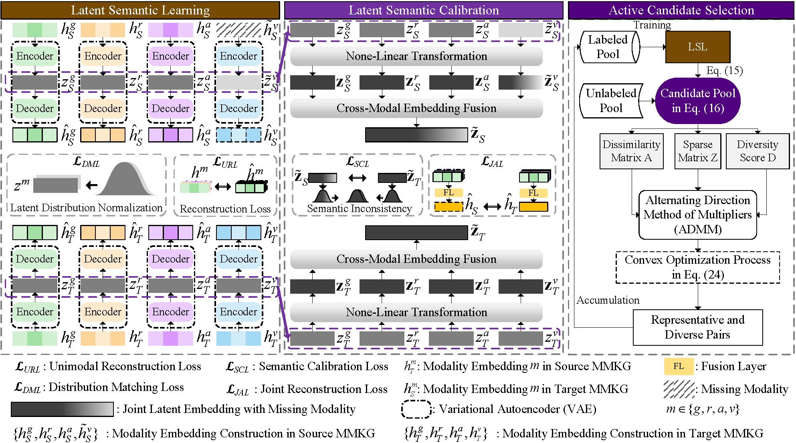

# Silence and Noise: Resolving Suppression and Overvaluation in Multimodal Entity Alignment

Official implementation of **ALMEA**.

**Xizhe Zhang, Meng-Fen Chiang, and Jingfeng Zhang**

## Overview

Multimodal entity alignment (MMEA) remains vulnerable to incomplete modalities
and cross-graph topological discrepancies. Existing studies commonly treat these
defects as separate reconstruction or alignment problems, overlooking how they
affect multimodal fusion. We systematically characterize two coupled failure
modes:

- **DM-induced overvaluation.** Detail Missing (DM) causes the model to
  overemphasize ambiguous modality representations produced from absent
  low-level information.
- **CI-induced suppression.** Context Imbalance (CI) allows modalities supported
  by information-rich graph contexts to dominate weaker modalities, leading to
  semantic drift.

ALMEA is a generative framework for iterative learning-based MMEA. It consists
of three components:

- **Cross-Modality Imputation (CMI)** restores missing low-level details from
  visible modalities.
- **Latent Semantic Calibration (LSC)** aligns reconstructed joint embeddings
  across knowledge graphs.
- **Controlled Iterative Selection (CIS)** selects representative and diverse
  candidate pairs when supervision is limited.

CMI and LSC form a bidirectional feedback loop: restored modality details
constrain semantic alignment, while aligned semantics guide subsequent
reconstruction. At a 20% supervision rate, ALMEA improves MRR and Hits@1 by up
to **5.20%** and **6.40%**, respectively, compared with the strongest baseline.

<p align="center">
  
</p>

## Experimental Scope

The paper evaluates ALMEA on the cross-KG benchmarks **FB15K-DB15K** and
**FB15K-YAGO15K**, using 20%, 50%, and 80% of the ground-truth aligned entity
pairs for training. It also reports multilingual results on
**DBP15K<sub>ZH-EN</sub>**, **DBP15K<sub>JA-EN</sub>**, and
**DBP15K<sub>FR-EN</sub>**.
Alignment is evaluated using MRR, Hits@1, and Hits@10.

The current experiment launcher provides the FB15K-DB15K and FB15K-YAGO15K
settings under the identifiers `FBDB15K` and `FBYG15K`, respectively.

## Setup

Install the dependencies with:

```bash
pip install -r requirements.txt
```

The versions used by this repository are listed in `requirements.txt`.

## Data

Download the processed MMKG data from
[Google Drive](https://drive.google.com/file/d/1cX1LEMwECwsadmBc3iMu5LTUS5wlwZ30/view?usp=sharing)
and extract it beside the repository:

```text
ROOT/
├── data/
│   └── mmkg/
│       ├── FBDB15K/
│       │   └── norm/
│       ├── FBYG15K/
│       │   └── norm/
│       ├── embedding/
│       └── pkls/
└── GitHub/
    └── ALMEA/
```

Following the experimental settings in the paper, graph structures are encoded
with GAT, textual attributes with GloVe-6B, and visual features with VGG16. All
modalities are projected into a 300-dimensional space.

## Backbone Interface

The repository keeps the MMEA backbone as an external interface. Add a backbone
under `src/pre_train_models/` and return it from
`src/pre_train_models/__init__.py`:

```python
from .your_model import YourModel


def build_model(kgs, args):
    return YourModel(kgs, args)
```

The backbone must implement:

```python
forward(batch)       # returns loss, output, sub_embeddings
get_embeddings()     # returns embeddings for all entities
```

`output` must contain `loss_dic` and may contain `weight`. `sub_embeddings` is
the modality-embedding list used by CIS. Model-specific options can be added to
`config.py`.

## Run Experiments

```bash
bash run_experiments.sh DEVICE DATASET EPOCH DATA_RATE MASKING ALPHA
```

| Argument | Description | Example |
|---|---|---|
| `DEVICE` | CUDA device index | `0` |
| `DATASET` | `FBDB15K` or `FBYG15K` | `FBDB15K` |
| `EPOCH` | Base-training epochs | `500` |
| `DATA_RATE` | Initial seed-alignment ratio | `0.2` |
| `MASKING` | Modality masking probability | `0.45` |
| `ALPHA` | CIS sparsification strength | `0.35` |

Example:

```bash
bash run_experiments.sh 0 FBDB15K 500 0.2 0.45 0.35
```

The main experiment commands are collected in `run.sh`. Other training options
and their defaults are defined in `config.py`.

## Repository Structure

```text
ALMEA/
├── picture/                    # Framework and analysis figures
├── src/
│   ├── data_processing/        # Dataset loading and preprocessing
│   ├── pre_train_models/       # External backbone interface
│   ├── torchlight/             # Logging and evaluation utilities
│   ├── ACS_ADMM.py             # CIS optimization
│   ├── Semantic_Calibration_KL.py
│   └── almea.py                # CMI and LSC
├── config.py
├── main.py                     # Training, evaluation, and CIS loop
├── requirements.txt
├── run.sh
└── run_experiments.sh
```

## Acknowledgements

This implementation benefits from the following open-source MMEA projects:

- [MCLEA](https://github.com/lzxlin/MCLEA)
- [MSNEA](https://github.com/liyichen-cly/MSNEA)
- [EVA](https://github.com/cambridgeltl/eva)
- [MMEA](https://github.com/liyichen-cly/MMEA)
- [MEAformer](https://github.com/zjukg/MEAformer)
- [GEEA](https://github.com/zjukg/GEEA)
